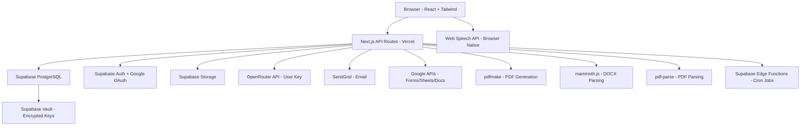
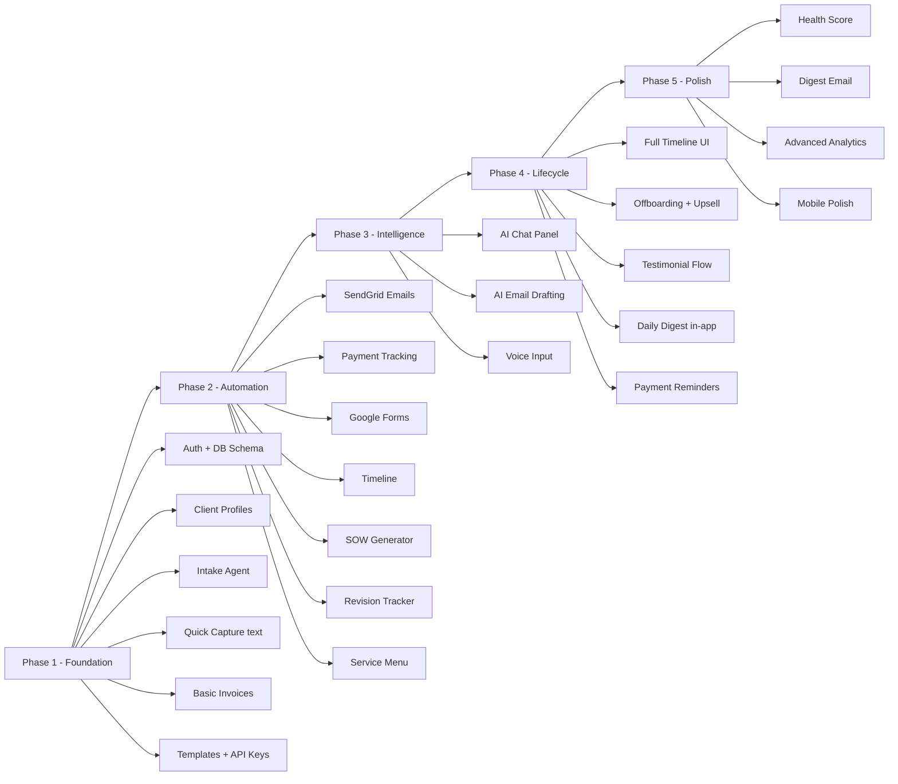

# FreelanceOS — Full Implementation Plan

> Based on PRD v1.2 (February 2026)

---

## 1. Architecture Overview



---

## 2. Tech Stack

| Layer | Technology | Notes |
|---|---|---|
| Frontend | React + Tailwind CSS | Next.js App Router |
| Backend | Next.js API Routes | Serverless on Vercel |
| Database | Supabase PostgreSQL | Free 500MB tier |
| Auth | Supabase Auth + Google OAuth | Built-in |
| Storage | Supabase Storage | Free 1GB |
| AI | OpenRouter API | User-supplied key |
| Email | SendGrid | Free 100/day |
| PDF Gen | pdfmake | Open source |
| DOCX Parse | mammoth.js | Open source |
| PDF Parse | pdf-parse | Open source |
| Google APIs | Forms + Sheets + Docs | OAuth 2.0 |
| Voice | Web Speech API | Browser native |
| Cron | Supabase Edge Functions | Overdue detection, testimonial countdown |
| Key Storage | Supabase Vault AES-256 | OpenRouter + SendGrid keys |

---

## 3. Project Directory Structure

```
freelanceos/
├── app/                          # Next.js App Router
│   ├── (auth)/
│   │   ├── login/page.tsx
│   │   └── callback/page.tsx
│   ├── (dashboard)/
│   │   ├── layout.tsx            # Sidebar + Quick Capture FAB
│   │   ├── page.tsx              # Main dashboard + Daily Digest
│   │   ├── clients/
│   │   │   ├── page.tsx          # Client list with Health Scores
│   │   │   ├── new/page.tsx      # Document Intake Agent
│   │   │   └── [id]/
│   │   │       ├── page.tsx      # Client profile
│   │   │       ├── timeline/page.tsx
│   │   │       ├── invoices/page.tsx
│   │   │       └── documents/page.tsx
│   │   ├── leads/
│   │   │   └── page.tsx          # Leads from Quick Capture
│   │   ├── analytics/
│   │   │   └── page.tsx          # Analytics dashboard
│   │   └── settings/
│   │       ├── page.tsx
│   │       ├── templates/page.tsx
│   │       ├── services/page.tsx
│   │       ├── notifications/page.tsx
│   │       ├── profile/page.tsx
│   │       └── api-keys/page.tsx
│   └── api/
│       ├── auth/[...supabase]/route.ts
│       ├── clients/
│       │   ├── route.ts           # GET list, POST create
│       │   └── [id]/route.ts      # GET, PATCH, DELETE
│       ├── leads/
│       │   ├── route.ts
│       │   └── [id]/convert/route.ts
│       ├── intake/
│       │   └── route.ts           # Document Intake Agent
│       ├── quick-capture/
│       │   └── route.ts           # AI parse text/voice
│       ├── invoices/
│       │   ├── route.ts
│       │   ├── [id]/route.ts
│       │   ├── [id]/send/route.ts
│       │   ├── [id]/mark-paid/route.ts
│       │   └── [id]/reminder/route.ts
│       ├── projects/
│       │   ├── route.ts
│       │   ├── [id]/start/route.ts
│       │   ├── [id]/timeline/route.ts
│       │   └── [id]/revisions/route.ts
│       ├── sow/
│       │   └── generate/route.ts  # SOW Generator
│       ├── emails/
│       │   ├── send/route.ts
│       │   └── webhook/route.ts   # SendGrid open tracking
│       ├── ai/
│       │   ├── chat/route.ts      # AI Assistant
│       │   └── draft-email/route.ts
│       ├── google/
│       │   ├── oauth/route.ts
│       │   └── forms/poll/route.ts
│       ├── analytics/
│       │   └── route.ts
│       ├── digest/
│       │   └── route.ts           # Daily Digest data
│       ├── templates/
│       │   └── route.ts
│       ├── services/
│       │   └── route.ts
│       └── settings/
│           └── api-keys/route.ts
├── components/
│   ├── ui/                        # Shadcn/ui base components
│   ├── layout/
│   │   ├── Sidebar.tsx
│   │   ├── TopBar.tsx
│   │   └── QuickCaptureFAB.tsx    # Floating Action Button
│   ├── dashboard/
│   │   ├── DailyDigestPanel.tsx
│   │   ├── OverdueBanner.tsx
│   │   ├── StatsCards.tsx
│   │   └── RecentActivity.tsx
│   ├── clients/
│   │   ├── ClientCard.tsx         # With Health Score indicator
│   │   ├── ClientList.tsx
│   │   ├── ClientProfile.tsx
│   │   ├── HealthScoreIndicator.tsx
│   │   └── ClientFilters.tsx
│   ├── intake/
│   │   ├── DocumentUploader.tsx
│   │   ├── ExtractionReview.tsx
│   │   └── TemplateMatchPrompt.tsx
│   ├── quick-capture/
│   │   ├── QuickCaptureModal.tsx
│   │   ├── VoiceInput.tsx
│   │   └── ParsedFieldsReview.tsx
│   ├── invoices/
│   │   ├── InvoiceForm.tsx
│   │   ├── InvoiceCard.tsx
│   │   ├── InvoiceStatusBadge.tsx
│   │   └── PaymentBanner.tsx
│   ├── projects/
│   │   ├── StartProjectButton.tsx
│   │   ├── ProjectTimeline.tsx
│   │   ├── TimelineStage.tsx
│   │   ├── RevisionTracker.tsx
│   │   └── ScopeOfWorkEditor.tsx
│   ├── ai/
│   │   ├── AIChatPanel.tsx
│   │   └── EmailDraftModal.tsx
│   ├── analytics/
│   │   ├── RevenueChart.tsx
│   │   ├── OutstandingDonut.tsx
│   │   └── PerClientTable.tsx
│   └── settings/
│       ├── TemplateEditor.tsx
│       ├── ServiceEditor.tsx
│       └── APIKeyManager.tsx
├── lib/
│   ├── supabase/
│   │   ├── client.ts
│   │   ├── server.ts
│   │   └── middleware.ts
│   ├── ai/
│   │   ├── openrouter.ts
│   │   ├── parse-capture.ts       # Quick Capture AI parsing
│   │   ├── extract-document.ts    # Intake Agent extraction
│   │   └── generate-sow.ts        # SOW generation
│   ├── email/
│   │   ├── sendgrid.ts
│   │   └── templates/
│   │       ├── onboarding.ts
│   │       ├── invoice.ts
│   │       ├── payment-reminder.ts
│   │       ├── revision-limit.ts
│   │       ├── offboarding.ts
│   │       └── testimonial-request.ts
│   ├── pdf/
│   │   ├── generate-invoice.ts
│   │   └── generate-sow.ts
│   ├── parsers/
│   │   ├── parse-docx.ts
│   │   └── parse-pdf.ts
│   ├── google/
│   │   ├── oauth.ts
│   │   └── forms-poller.ts
│   ├── health-score.ts            # Client Health Score calculator
│   └── utils.ts
├── hooks/
│   ├── useQuickCapture.ts
│   ├── useVoiceInput.ts
│   ├── useHealthScore.ts
│   └── useDailyDigest.ts
├── types/
│   └── index.ts                   # All TypeScript types
├── supabase/
│   ├── migrations/                # SQL migration files
│   └── functions/
│       ├── check-overdue/         # Edge Function cron
│       └── testimonial-countdown/ # Edge Function cron
└── middleware.ts                  # Auth protection
```

---

## 4. Database Schema

### 4.1 Core Tables

```sql
-- Users (managed by Supabase Auth, extended profile)
CREATE TABLE user_profiles (
  id UUID PRIMARY KEY REFERENCES auth.users(id),
  full_name TEXT,
  business_name TEXT,
  email TEXT,
  google_business_url TEXT,
  invoice_template JSONB,
  digest_email_enabled BOOLEAN DEFAULT false,
  digest_email_time TIME DEFAULT '08:00',
  testimonial_delay_days INTEGER DEFAULT 14,
  invoice_payment_terms_days INTEGER DEFAULT 14,
  created_at TIMESTAMPTZ DEFAULT NOW()
);

-- Leads (from Quick Capture, before conversion)
CREATE TABLE leads (
  id UUID PRIMARY KEY DEFAULT gen_random_uuid(),
  user_id UUID REFERENCES auth.users(id),
  name TEXT NOT NULL,
  email TEXT,
  project_hint TEXT,
  budget_hint NUMERIC,
  deadline_hint TEXT,
  source TEXT DEFAULT 'quick_capture',
  raw_input TEXT,
  converted BOOLEAN DEFAULT false,
  converted_client_id UUID,
  created_at TIMESTAMPTZ DEFAULT NOW()
);

-- Clients
CREATE TABLE clients (
  id UUID PRIMARY KEY DEFAULT gen_random_uuid(),
  user_id UUID REFERENCES auth.users(id),
  name TEXT NOT NULL,
  email TEXT,
  phone TEXT,
  company TEXT,
  source TEXT, -- 'form' | 'intake' | 'quick_capture' | 'manual'
  status TEXT DEFAULT 'active', -- 'active' | 'completed' | 'paused'
  health_score TEXT DEFAULT 'grey', -- 'green' | 'amber' | 'red' | 'grey'
  testimonial_status TEXT DEFAULT 'not_requested', -- 'not_requested' | 'sent' | 'received'
  testimonial_sent_at TIMESTAMPTZ,
  testimonial_content TEXT,
  created_at TIMESTAMPTZ DEFAULT NOW()
);

-- Projects
CREATE TABLE projects (
  id UUID PRIMARY KEY DEFAULT gen_random_uuid(),
  client_id UUID REFERENCES clients(id),
  user_id UUID REFERENCES auth.users(id),
  name TEXT NOT NULL,
  description TEXT,
  budget NUMERIC,
  start_date DATE,
  deadline DATE,
  status TEXT DEFAULT 'draft', -- 'draft' | 'active' | 'completed'
  template_id UUID REFERENCES project_templates(id),
  revision_limit INTEGER DEFAULT 3,
  revisions_used INTEGER DEFAULT 0,
  sow_generated BOOLEAN DEFAULT false,
  sow_url TEXT,
  offboarding_complete_at TIMESTAMPTZ,
  testimonial_countdown_start TIMESTAMPTZ,
  created_at TIMESTAMPTZ DEFAULT NOW()
);

-- Invoices
CREATE TABLE invoices (
  id UUID PRIMARY KEY DEFAULT gen_random_uuid(),
  client_id UUID REFERENCES clients(id),
  project_id UUID REFERENCES projects(id),
  user_id UUID REFERENCES auth.users(id),
  invoice_number TEXT,
  line_items JSONB, -- [{description, quantity, unit_price, total}]
  subtotal NUMERIC,
  tax_rate NUMERIC DEFAULT 0,
  total NUMERIC,
  status TEXT DEFAULT 'draft', -- 'draft' | 'sent' | 'viewed' | 'paid' | 'overdue'
  due_date DATE,
  paid_date DATE,
  sent_at TIMESTAMPTZ,
  viewed_at TIMESTAMPTZ,
  pdf_url TEXT,
  sendgrid_message_id TEXT,
  created_at TIMESTAMPTZ DEFAULT NOW()
);

-- Timeline Stages
CREATE TABLE timeline_stages (
  id UUID PRIMARY KEY DEFAULT gen_random_uuid(),
  project_id UUID REFERENCES projects(id),
  user_id UUID REFERENCES auth.users(id),
  stage_number INTEGER NOT NULL, -- 1-10
  name TEXT NOT NULL,
  status TEXT DEFAULT 'pending', -- 'pending' | 'in_progress' | 'completed'
  scheduled_date DATE,
  completed_date DATE,
  notes TEXT,
  created_at TIMESTAMPTZ DEFAULT NOW()
);

-- Documents
CREATE TABLE documents (
  id UUID PRIMARY KEY DEFAULT gen_random_uuid(),
  client_id UUID REFERENCES clients(id),
  user_id UUID REFERENCES auth.users(id),
  type TEXT, -- 'srs' | 'sow' | 'invoice' | 'contract' | 'other'
  name TEXT,
  file_url TEXT,
  created_at TIMESTAMPTZ DEFAULT NOW()
);

-- Email Logs
CREATE TABLE email_logs (
  id UUID PRIMARY KEY DEFAULT gen_random_uuid(),
  client_id UUID REFERENCES clients(id),
  user_id UUID REFERENCES auth.users(id),
  type TEXT, -- 'onboarding' | 'invoice' | 'kickoff' | 'update' | 'offboarding' | 'reminder' | 'revision_limit' | 'testimonial'
  subject TEXT,
  body TEXT,
  status TEXT DEFAULT 'draft', -- 'draft' | 'sent' | 'opened'
  sendgrid_message_id TEXT,
  sent_at TIMESTAMPTZ,
  opened_at TIMESTAMPTZ,
  created_at TIMESTAMPTZ DEFAULT NOW()
);

-- Revisions
CREATE TABLE revisions (
  id UUID PRIMARY KEY DEFAULT gen_random_uuid(),
  project_id UUID REFERENCES projects(id),
  user_id UUID REFERENCES auth.users(id),
  note TEXT,
  created_at TIMESTAMPTZ DEFAULT NOW()
);

-- Project Templates
CREATE TABLE project_templates (
  id UUID PRIMARY KEY DEFAULT gen_random_uuid(),
  user_id UUID REFERENCES auth.users(id),
  name TEXT NOT NULL, -- 'Landing Page' | 'Business Website' | 'E-commerce Store'
  deliverables JSONB, -- string[]
  timeline_stages JSONB, -- [{name, estimated_days}]
  revision_limit INTEGER DEFAULT 3,
  base_price NUMERIC,
  price_range_max NUMERIC,
  out_of_scope JSONB, -- string[]
  deposit_percentage NUMERIC DEFAULT 50,
  created_at TIMESTAMPTZ DEFAULT NOW()
);

-- Services (Service Menu)
CREATE TABLE services (
  id UUID PRIMARY KEY DEFAULT gen_random_uuid(),
  user_id UUID REFERENCES auth.users(id),
  name TEXT NOT NULL,
  description TEXT,
  price NUMERIC,
  price_type TEXT DEFAULT 'fixed', -- 'fixed' | 'starting_from'
  delivery_time TEXT,
  tags TEXT[],
  created_at TIMESTAMPTZ DEFAULT NOW()
);

-- API Keys (encrypted via Supabase Vault)
CREATE TABLE api_keys (
  id UUID PRIMARY KEY DEFAULT gen_random_uuid(),
  user_id UUID REFERENCES auth.users(id),
  service TEXT NOT NULL, -- 'openrouter' | 'sendgrid'
  encrypted_key TEXT, -- stored via Supabase Vault
  is_valid BOOLEAN,
  last_tested_at TIMESTAMPTZ,
  created_at TIMESTAMPTZ DEFAULT NOW()
);

-- Google OAuth Connections
CREATE TABLE google_connections (
  id UUID PRIMARY KEY DEFAULT gen_random_uuid(),
  user_id UUID REFERENCES auth.users(id),
  access_token TEXT,
  refresh_token TEXT,
  connected_form_id TEXT,
  connected_sheet_id TEXT,
  last_polled_at TIMESTAMPTZ,
  created_at TIMESTAMPTZ DEFAULT NOW()
);
```

### 4.2 Row Level Security (RLS)

All tables enforce `user_id = auth.uid()` policies so each freelancer only sees their own data.

---

## 5. API Routes Plan

### Auth
| Method | Route | Description |
|---|---|---|
| GET | `/api/auth/callback` | Supabase OAuth callback |

### Clients
| Method | Route | Description |
|---|---|---|
| GET | `/api/clients` | List all clients with health scores |
| POST | `/api/clients` | Create client manually |
| GET | `/api/clients/[id]` | Get client profile |
| PATCH | `/api/clients/[id]` | Update client |
| DELETE | `/api/clients/[id]` | Delete client |

### Leads
| Method | Route | Description |
|---|---|---|
| GET | `/api/leads` | List all leads |
| POST | `/api/leads` | Create lead |
| POST | `/api/leads/[id]/convert` | Convert lead to client |

### Intake Agent
| Method | Route | Description |
|---|---|---|
| POST | `/api/intake` | Upload doc + extract fields via AI |

### Quick Capture
| Method | Route | Description |
|---|---|---|
| POST | `/api/quick-capture` | Parse free-form text/voice via AI |

### Invoices
| Method | Route | Description |
|---|---|---|
| GET | `/api/invoices` | List all invoices |
| POST | `/api/invoices` | Create invoice |
| GET | `/api/invoices/[id]` | Get invoice |
| PATCH | `/api/invoices/[id]` | Update invoice |
| POST | `/api/invoices/[id]/send` | Send invoice via SendGrid |
| POST | `/api/invoices/[id]/mark-paid` | Mark invoice as paid |
| POST | `/api/invoices/[id]/reminder` | Send payment reminder |

### Projects
| Method | Route | Description |
|---|---|---|
| GET | `/api/projects/[id]` | Get project |
| PATCH | `/api/projects/[id]` | Update project |
| POST | `/api/projects/[id]/start` | Start project lifecycle |
| GET | `/api/projects/[id]/timeline` | Get timeline stages |
| PATCH | `/api/projects/[id]/timeline/[stageId]` | Update stage status |
| POST | `/api/projects/[id]/revisions` | Log a revision |

### SOW
| Method | Route | Description |
|---|---|---|
| POST | `/api/sow/generate` | Generate SOW PDF via AI + pdfmake |

### Emails
| Method | Route | Description |
|---|---|---|
| POST | `/api/emails/send` | Send any email type |
| POST | `/api/emails/webhook` | SendGrid open-tracking webhook |

### AI
| Method | Route | Description |
|---|---|---|
| POST | `/api/ai/chat` | AI Assistant chat |
| POST | `/api/ai/draft-email` | Draft email with AI |

### Google
| Method | Route | Description |
|---|---|---|
| GET | `/api/google/oauth` | Initiate Google OAuth |
| POST | `/api/google/forms/poll` | Poll Google Forms for new responses |

### Analytics
| Method | Route | Description |
|---|---|---|
| GET | `/api/analytics` | Get earnings, outstanding, overdue stats |

### Daily Digest
| Method | Route | Description |
|---|---|---|
| GET | `/api/digest` | Get today's digest items |

### Templates & Services
| Method | Route | Description |
|---|---|---|
| GET/POST | `/api/templates` | List/create templates |
| PATCH/DELETE | `/api/templates/[id]` | Update/delete template |
| GET/POST | `/api/services` | List/create services |
| PATCH/DELETE | `/api/services/[id]` | Update/delete service |

### Settings
| Method | Route | Description |
|---|---|---|
| GET/POST | `/api/settings/api-keys` | Manage encrypted API keys |
| POST | `/api/settings/api-keys/test` | Test API key validity |

---

## 6. Component Hierarchy

```
App Layout
├── Sidebar (navigation links)
├── TopBar (user menu, notifications)
├── QuickCaptureFAB (floating '+' button, always visible)
│   └── QuickCaptureModal
│       ├── TextInput (free-form, 500 char)
│       ├── VoiceInput (Web Speech API)
│       ├── QuickForm (5-field fallback)
│       └── ParsedFieldsReview (confirm before save)
│
├── Dashboard Page
│   ├── DailyDigestPanel
│   │   ├── DigestSection (invoices due, overdue, no activity, etc.)
│   │   └── DigestActionButton (per item)
│   ├── OverdueBanner (red, when any invoice overdue)
│   ├── StatsCards (earnings, outstanding, overdue, active clients)
│   └── RecentActivity
│
├── Clients Page
│   ├── ClientFilters (status, health score filter)
│   └── ClientList
│       └── ClientCard
│           ├── HealthScoreIndicator (green/amber/red/grey circle)
│           └── ClientCardActions
│
├── Client Profile Page
│   ├── ClientHeader (name, project, status, StartProjectButton)
│   ├── ContactInfo
│   ├── ProjectDetails
│   │   ├── RevisionTracker (counter + progress bar)
│   │   └── ScopeOfWorkSection (generate/view SOW)
│   ├── DocumentsSection
│   ├── ProjectTimeline
│   │   └── TimelineStage (x10, with complete button)
│   ├── InvoicesSection
│   │   └── InvoiceCard (status badge, actions)
│   ├── EmailHistory
│   └── AIChatPanel (context-aware)
│
├── Leads Page
│   └── LeadCard (with Convert to Client button)
│
├── Analytics Page
│   ├── PaymentBanner (received, outstanding, overdue)
│   ├── RevenueChart (monthly bar)
│   ├── OutstandingDonut
│   └── PerClientTable
│
└── Settings Pages
    ├── Templates (create/edit/delete project templates)
    ├── Services (create/edit/delete service menu items)
    ├── Notifications (digest email toggle + time)
    ├── Profile (name, business, Google Business URL)
    └── API Keys (OpenRouter, SendGrid — masked, testable)
```

---

## 7. Phased Implementation Plan

### Phase 1 — Foundation (Weeks 1–5)

**Goal:** Working app with auth, client management, document intake, basic invoicing, and templates.

#### Step 1.1 — Project Bootstrap
- [ ] Initialize Next.js 14 app with TypeScript and Tailwind CSS
- [ ] Install and configure Shadcn/ui component library
- [ ] Set up Supabase project (DB + Auth + Storage)
- [ ] Configure environment variables (`.env.local`)
- [ ] Set up Vercel deployment pipeline
- [ ] Configure ESLint, Prettier, and TypeScript strict mode

#### Step 1.2 — Authentication
- [ ] Implement Supabase Auth with email/password
- [ ] Add Google OAuth via Supabase Auth provider
- [ ] Create login page (`/login`)
- [ ] Create OAuth callback handler (`/api/auth/callback`)
- [ ] Implement `middleware.ts` to protect all dashboard routes
- [ ] Create `user_profiles` table and seed on first login

#### Step 1.3 — Database Schema
- [ ] Write and run all SQL migrations for all tables
- [ ] Enable Row Level Security on all tables
- [ ] Create RLS policies (`user_id = auth.uid()`)
- [ ] Seed 3 starter project templates (Landing Page, Business Website, E-commerce Store)
- [ ] Seed 4 starter service entries (Website Maintenance, SEO Audit, Landing Page, Social Media Integration)

#### Step 1.4 — Layout & Navigation
- [ ] Build `Sidebar` component with all navigation links
- [ ] Build `TopBar` with user menu
- [ ] Build dashboard layout wrapper
- [ ] Add `QuickCaptureFAB` (floating '+' button) to layout — modal wired up in Phase 3

#### Step 1.5 — Client Profiles (Module 4)
- [ ] Build `ClientList` page with basic cards
- [ ] Build `ClientProfile` page with all sections (header, contact, project details, documents, timeline placeholder, invoices placeholder, email history)
- [ ] Implement CRUD API routes for clients
- [ ] Add client status badge (active/completed/paused)

#### Step 1.6 — Document Intake Agent (Module 1)
- [ ] Install `mammoth.js` and `pdf-parse`
- [ ] Build `DocumentUploader` component (drag-and-drop, PDF/DOCX/Google Docs URL)
- [ ] Implement `/api/intake` route: parse document → send to OpenRouter → extract fields
- [ ] Build `ExtractionReview` component (amber highlights for uncertain fields, editable)
- [ ] Build `TemplateMatchPrompt` component (suggest matching template)
- [ ] Wire up 4 auto-actions: create onboarding email draft, invoice draft, timeline draft, SOW draft
- [ ] Handle AI fallback (no API key configured → blank fields + prompt)

#### Step 1.7 — Quick Capture — Text Only (Module 2, partial)
- [ ] Build `QuickCaptureModal` with text input
- [ ] Implement `/api/quick-capture` route: send text to OpenRouter → extract name, email, project, budget, deadline
- [ ] Build `ParsedFieldsReview` component
- [ ] Save as Lead or promote to Client
- [ ] Build `Leads` page with `LeadCard` and Convert to Client button

#### Step 1.8 — Invoice Generation (Module 6, basic)
- [ ] Install `pdfmake`
- [ ] Build `InvoiceForm` component (line items, total, due date)
- [ ] Implement `/api/invoices` CRUD routes
- [ ] Implement `/lib/pdf/generate-invoice.ts` using pdfmake
- [ ] Store generated PDF in Supabase Storage
- [ ] Show invoice status badge (Draft/Sent/Viewed/Paid/Overdue)

#### Step 1.9 — Start Project Button (Module 5)
- [ ] Build `StartProjectButton` component with 4 states (Disabled/Ready/Active/Completed)
- [ ] Implement `/api/projects/[id]/start` route
- [ ] On click: set status to Active, record start date, prompt to send onboarding email

#### Step 1.10 — Project Brief Templates (Module 12, basic)
- [ ] Build `TemplateEditor` in Settings → Templates
- [ ] Implement CRUD API routes for templates
- [ ] Wire template selection into client creation flow

#### Step 1.11 — API Key Management (Module 19)
- [ ] Build `APIKeyManager` component in Settings → API Keys
- [ ] Implement `/api/settings/api-keys` routes using Supabase Vault
- [ ] Mask keys in UI (show last 4 chars only)
- [ ] Add "Test Connection" button for each key
- [ ] Show alert banner when key is missing or invalid

#### Step 1.12 — Analytics Shell (Module 8, basic)
- [ ] Build Analytics page with placeholder cards
- [ ] Implement `/api/analytics` route returning basic stats
- [ ] Show: Total Earnings, Total Received, Total Outstanding, Active Clients

---

### Phase 2 — Automation & Protection (Weeks 6–9)

**Goal:** Email automation, Google Forms integration, SOW generation, revision tracking, service menu.

#### Step 2.1 — SendGrid Email Integration (Module 14)
- [ ] Install and configure SendGrid SDK
- [ ] Build `/lib/email/sendgrid.ts` wrapper
- [ ] Build all email templates: onboarding, invoice, kickoff, update, offboarding, payment reminder, revision limit, testimonial request
- [ ] Implement `/api/emails/send` route
- [ ] Implement `/api/emails/webhook` for SendGrid open-tracking
- [ ] Log all sent emails to `email_logs` table
- [ ] Show email history on client profile

#### Step 2.2 — Invoice Sending & Payment Tracking (Module 7)
- [ ] Wire invoice send to SendGrid (`/api/invoices/[id]/send`)
- [ ] Implement Mark Paid flow with payment date input
- [ ] Implement one-click Send Reminder for overdue invoices
- [ ] Build `OverdueBanner` on main dashboard
- [ ] Build `PaymentBanner` on analytics page (received, outstanding, overdue)
- [ ] Implement Supabase Edge Function cron to auto-set Overdue status daily

#### Step 2.3 — Google Forms Integration (Module 3)
- [ ] Implement Google OAuth flow (`/api/google/oauth`)
- [ ] Store OAuth tokens in `google_connections` table
- [ ] Implement `/api/google/forms/poll` route (poll every 5 min via cron)
- [ ] Map form responses to client profile fields
- [ ] Trigger same 4 auto-actions as Intake Agent on new response
- [ ] Add manual CSV upload fallback

#### Step 2.4 — Project Timeline (Module 15)
- [ ] Build `ProjectTimeline` component with 10 stages
- [ ] Build `TimelineStage` component (mark complete, add notes)
- [ ] Implement timeline CRUD API routes
- [ ] Auto-draft timeline from SRS milestones (via AI)
- [ ] Stage 9 completion → prompt offboarding email
- [ ] Stage 10 completion → start testimonial countdown

#### Step 2.5 — Scope of Work Generator (Module 10)
- [ ] Build `ScopeOfWorkEditor` component (editable sections)
- [ ] Implement `/api/sow/generate` route (AI generates SOW from project data)
- [ ] Implement `/lib/pdf/generate-sow.ts` using pdfmake
- [ ] Store SOW PDF in Supabase Storage + attach to client Documents
- [ ] Wire SOW revision count to Revision Tracker
- [ ] Add "Generate SOW" button to client profile (appears after project started)

#### Step 2.6 — Revision Tracker (Module 11)
- [ ] Build `RevisionTracker` component (counter + progress bar)
- [ ] Implement `/api/projects/[id]/revisions` POST route
- [ ] Show "Revision limit reached" banner at limit
- [ ] Wire one-click "Send Limit Email" to pre-drafted email template
- [ ] Pull revision limit from Project Brief Template or manual input

#### Step 2.7 — Service Menu (Module 18)
- [ ] Build `ServiceEditor` in Settings → Services
- [ ] Implement CRUD API routes for services
- [ ] Wire service prices as invoice line items
- [ ] Wire service suggestions into offboarding email upsell block

---

### Phase 3 — Intelligence (Weeks 10–13)

**Goal:** Full AI assistant, AI email drafting, voice input for Quick Capture.

#### Step 3.1 — OpenRouter AI Assistant (Module 13)
- [ ] Build `AIChatPanel` component (persistent slide-over panel)
- [ ] Implement `/api/ai/chat` route using OpenRouter API
- [ ] Inject full client context when opened from a client profile
- [ ] Support model selection (dropdown in settings)
- [ ] Allow content editing before sending

#### Step 3.2 — AI Email Drafting (Module 14, AI-enhanced)
- [ ] Build `EmailDraftModal` component
- [ ] Implement `/api/ai/draft-email` route
- [ ] Wire AI drafting to all email types (onboarding, offboarding, testimonial, etc.)
- [ ] Allow freelancer to edit draft before sending

#### Step 3.3 — Quick Capture Voice Input (Module 2, complete)
- [ ] Build `VoiceInput` component using Web Speech API
- [ ] Add microphone button to `QuickCaptureModal`
- [ ] Handle Firefox graceful fallback (show text-only mode)
- [ ] Wire voice transcript to same AI parsing flow as text

#### Step 3.4 — AI-Enhanced Intake Agent
- [ ] Improve extraction accuracy with structured prompts
- [ ] Add confidence scoring for extracted fields (amber highlights)
- [ ] Wire AI to suggest matching Project Brief Template based on description keywords

---

### Phase 4 — Lifecycle & Retention (Weeks 14–17)

**Goal:** Full timeline UI, offboarding automation, upsell flows, payment reminders, testimonial flow, Daily Digest.

#### Step 4.1 — Full Timeline UI (Module 15, complete)
- [ ] Polish `ProjectTimeline` with visual progress indicator
- [ ] Add stage scheduling (set expected dates)
- [ ] Add stage notes and history
- [ ] Wire stage completion to health score recalculation

#### Step 4.2 — Offboarding Automation
- [ ] Build offboarding email with Service Menu upsell block
- [ ] Allow freelancer to select which services to include
- [ ] Trigger offboarding prompt on Stage 9 completion

#### Step 4.3 — Testimonial Request Flow (Module 17)
- [ ] Implement 14-day countdown after Stage 10 completion (Supabase Edge Function)
- [ ] Build testimonial request email template (AI-drafted)
- [ ] Surface in Daily Digest: "Time to request a testimonial from [Client]"
- [ ] Allow freelancer to review, edit, and send with one click
- [ ] Log sent status to client profile
- [ ] Allow saving received testimonial text to client profile
- [ ] Implement dismiss (no re-prompt for that client)

#### Step 4.4 — Daily Digest (Module 16)
- [ ] Build `DailyDigestPanel` component on main dashboard
- [ ] Implement `/api/digest` route aggregating all digest items
- [ ] Show: invoices due this week, overdue payments, inactive clients, today's timeline actions, upcoming deadlines, pending drafts, leads not followed up
- [ ] Each item has a direct action button
- [ ] Real-time removal when items are resolved
- [ ] "You're all caught up" empty state

#### Step 4.5 — Payment Reminders (Module 7, complete)
- [ ] Auto-send payment reminder on due date (Supabase Edge Function cron)
- [ ] One-click reminder from Daily Digest and invoice list
- [ ] Per-client payment history table

---

### Phase 5 — Polish & Growth (Weeks 18–21)

**Goal:** Client Health Score, digest email, advanced analytics, mobile optimization.

#### Step 5.1 — Client Health Score (Module 9)
- [ ] Implement `/lib/health-score.ts` calculator (5 factors)
- [ ] Build `HealthScoreIndicator` component (green/amber/red/grey circle)
- [ ] Add tooltip showing contributing factors
- [ ] Clicking indicator jumps to relevant client profile section
- [ ] Add "Show clients needing attention" filter on Clients page
- [ ] Real-time recalculation on any factor change

#### Step 5.2 — Daily Digest Email (Module 16, complete)
- [ ] Build digest email template (SendGrid)
- [ ] Implement Supabase Edge Function cron to send at configured time
- [ ] Add toggle in Settings → Notifications
- [ ] Configurable send time

#### Step 5.3 — Advanced Analytics (Module 8, complete)
- [ ] Build `RevenueChart` (monthly bar chart using Recharts or Chart.js)
- [ ] Build `OutstandingDonut` chart
- [ ] Build `PerClientEarningsTable`
- [ ] Add date range filter
- [ ] Add per-client filter
- [ ] Invoice status breakdown chart

#### Step 5.4 — Mobile Optimization
- [ ] Audit and fix all responsive layouts
- [ ] Ensure Quick Capture, client profiles, and Daily Digest work on mobile
- [ ] Test on iOS Safari (Web Speech API support)
- [ ] Test on Android Chrome

#### Step 5.5 — Performance & Polish
- [ ] Implement offline queue for Quick Capture (localStorage → sync on reconnect)
- [ ] Optimize Supabase queries (indexes on `user_id`, `client_id`, `status`)
- [ ] Add loading skeletons for all data-fetching components
- [ ] WCAG 2.1 AA accessibility audit
- [ ] Error boundary components
- [ ] Toast notifications for all actions

---

## 8. Supabase Edge Functions (Cron Jobs)

| Function | Schedule | Purpose |
|---|---|---|
| `check-overdue` | Daily at 00:01 UTC | Set invoices to Overdue when due_date has passed |
| `testimonial-countdown` | Daily at 08:00 UTC | Check for projects where offboarding_complete_at + 14 days has passed; create digest item |
| `send-digest-email` | Configurable per user | Send Daily Digest email via SendGrid |
| `poll-google-forms` | Every 5 minutes | Poll connected Google Forms for new responses |

---

## 9. Key Integration Details

### 9.1 OpenRouter AI Prompts

**Quick Capture Parse Prompt:**
```
Extract the following fields from this text: name, email, project_type, budget (number), deadline (date or relative).
Return JSON: { name, email, project_type, budget, deadline, confidence_scores: {field: 0-1} }
Text: "{input}"
```

**Document Intake Extraction Prompt:**
```
Extract client and project information from this document text.
Return JSON: { client_name, client_email, project_name, budget, deadline, deliverables[], requirements[], timeline_milestones[] }
Flag uncertain fields with low confidence scores.
Document: "{text}"
```

**SOW Generation Prompt:**
```
Generate a professional Scope of Work document for a freelance project.
Project: {project_description}
Deliverables: {deliverables}
Budget: {budget}, Deposit: {deposit}%
Timeline: {start_date} to {deadline}
Revisions: {revision_limit}
Return JSON with sections: project_overview, deliverables[], out_of_scope[], revisions, payment_terms, timeline
```

### 9.2 Health Score Algorithm

```typescript
function calculateHealthScore(client, project, invoices, emailLogs, stages): 'green' | 'amber' | 'red' | 'grey' {
  if (!project || project.status === 'draft') return 'grey';
  
  let unhealthyFactors = 0;
  
  // Factor 1: Invoice payment
  const overdueInvoice = invoices.find(i => i.status === 'overdue');
  const overdueBy14 = overdueInvoice && daysSince(overdueInvoice.due_date) > 14;
  if (overdueBy14) return 'red'; // Immediate red
  if (overdueInvoice) unhealthyFactors++;
  
  // Factor 2: Communication recency
  const lastEmail = emailLogs.sort(desc).find(e => e.status === 'sent');
  if (!lastEmail || daysSince(lastEmail.sent_at) > 14) unhealthyFactors++;
  
  // Factor 3: Timeline progress
  const lastStageUpdate = stages.filter(s => s.status === 'completed').sort(desc)[0];
  if (!lastStageUpdate || daysSince(lastStageUpdate.completed_date) > 10) unhealthyFactors++;
  
  // Factor 4: Project start
  if (project.status !== 'active') unhealthyFactors++;
  
  // Factor 5: Revision count
  if (project.revisions_used >= project.revision_limit) unhealthyFactors++;
  
  if (unhealthyFactors >= 3) return 'red';
  if (unhealthyFactors >= 1) return 'amber';
  return 'green';
}
```

### 9.3 Project Timeline — 10 Default Stages

| # | Stage Name |
|---|---|
| 1 | Project Kickoff |
| 2 | Requirements Gathering |
| 3 | Design / Wireframes |
| 4 | Design Approval |
| 5 | Development — Phase 1 |
| 6 | Development — Phase 2 |
| 7 | Internal Review |
| 8 | Client Review & Revisions |
| 9 | Project Delivered |
| 10 | Offboarding Complete |

---

## 10. Environment Variables

```env
# Supabase
NEXT_PUBLIC_SUPABASE_URL=
NEXT_PUBLIC_SUPABASE_ANON_KEY=
SUPABASE_SERVICE_ROLE_KEY=

# Google OAuth (configured in Supabase dashboard)
GOOGLE_CLIENT_ID=
GOOGLE_CLIENT_SECRET=

# App
NEXT_PUBLIC_APP_URL=https://your-app.vercel.app

# SendGrid (stored per-user in Supabase Vault, but fallback for system emails)
SENDGRID_API_KEY=

# Encryption
VAULT_ENCRYPTION_KEY=
```

---

## 11. Open Questions (from PRD) — Recommended Defaults

| Question | Recommended Default |
|---|---|
| Default AI model for intake/Quick Capture | `google/gemini-flash-1.5` (fast, low cost) |
| Daily Digest email on by default? | **Opt-in** (off by default, user enables in Settings) |
| Auto-convert leads after X days? | **No** — always require manual promotion |
| Default payment terms | **Net 14** (configurable in Settings) |
| SOW digital acknowledgement? | **Send-only** for v1.0; DocuSign integration deferred |
| Testimonial email include pre-written template? | **Yes** — include editable template to lower friction |

---

## 12. Implementation Sequence Summary



---

*End of FreelanceOS Implementation Plan — v1.0*
